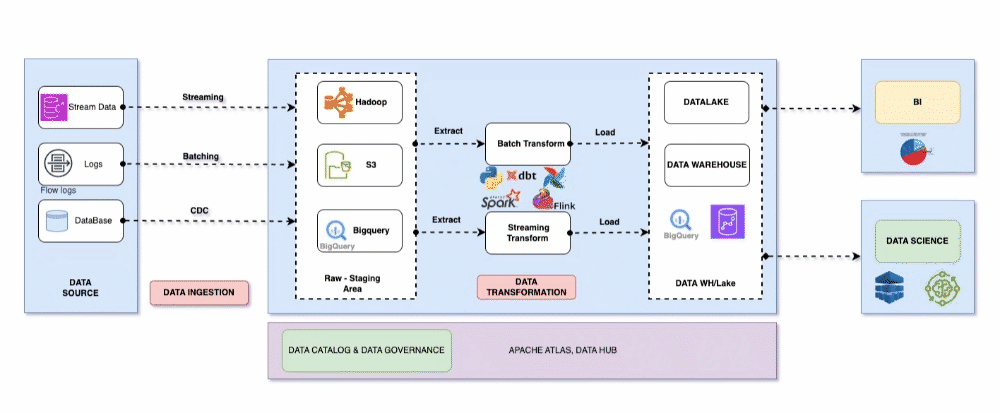
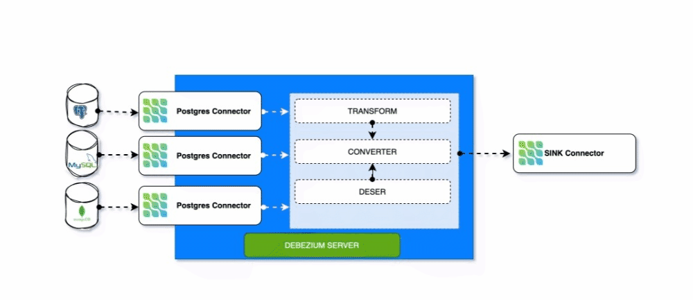

# Building a Complete Dataplatform
Synthesize knowledge related to building a complete data platform system
### Clouds:

### On primise

## Main Stack
- Data Ingestion
- Data Processing & Transformation
- Data Governance & Data Catalogs
- Data Warehouse & Datalake
- Data Analytics

## Tools for Big Data Engineer
### Workflow Schedule
1. Airflow

## Data Ingestion
### Batch Ingestion
1. SASS Tool: Fivetran, Hevo Data ..
2. Opensource Tools: Airbyte, Singer, Streamsets
3. Custom Data Ingestion built in on orchestration engines like: Python + Airflow, Java Application, Other ...
### Streaming Ingestion
1. Apache Spark
2. Apache Flink
### CDC (Change Data Capture)
1. Debezium

## Data Transformation
### Batch
1. DBT (Data Build Tool)
2. Apache Spark
3. Apache Flink
### Streaming
1. Apache Spark
2. Apache Flink

## Data Warehouse & Lake
### Data Warehouse Storage
1. Hadoop
2. Bigquery
3. Redshift
4. Snowflake

### Data Lake Storage
1. Hadoop (On primise)
2. Google Cloud Storage (GCP)
3. S3 (AWS)
## Data Governance
1. Apache Atlas
2. Azure Microsoft Purview 
3. Data Catalog(GCP)
4. Unity Catalog
## Data Analysis

1. Metabase
2. Superset
3. PowerBI
4. Data Looker
5. Tableau

## MLOps
1. Kubeflow
2. Minio
## Contact Me
- 😀 LinkedIn: https://www.linkedin.com/tuanbacam
- 🌱 Email: nguyenvantuan140497@gmail.com
- 🇻🇳 Country: VietNam